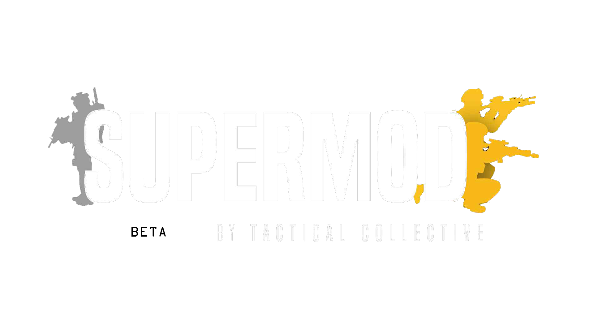

 

<h1 align="center">SuperMod Server Template</h1>

<h4 align="center"> Configuration files for Squad servers using the SuperMod mod </h4>

    <a href="https://github.com/Nicolas-Colombier/SuperMod-Server-Template#Instruction">Instruction</a> •
    <a href="https://github.com/Nicolas-Colombier/SuperMod-Server-Template#Infos">Infos</a> •
    <a href="https://github.com/Nicolas-Colombier/SuperMod-Server-Template#levels-layers-for-map-voting">Levels/Layers for map voting</a> •
    <a href="https://github.com/Nicolas-Colombier/SuperMod-Server-Template#levels-layers-for-standard-rotation">Levels/Layers for standard rotation</a> •
    <a href="https://github.com/Nicolas-Colombier/SuperMod-Server-Template#miscellaneous">Miscellaneous</a> •
    <a href="https://github.com/Nicolas-Colombier/SuperMod-Server-Template#squadsdm">SquadSDM</a>

 

## Instruction
- "**$word**", it means it's a variable. You must change it to your need.

- You must put the configuration files inside your ServerConfig directory
  * **Windows** : `C:\$InstallationFolde\serverfiles\SquadGame\ServerConfig\`
  * **Linux** : `/home/$InstallationFolder\serverfiles/SquadGame/ServerConfig/` 

## Infos
- Special forces do not benefit from HABs but have an unlimited number of rally points with the usual delay between two placement.
- Special forces Squad leaders can place their rally on another Squad Leader's rally (buddy rally).
- Special forces still have access to radios but lack large construction capabilities.
- Special forces come equipped with advanced gear and light vehicles, giving them a natural advantage over the enemy.
- [_SuperModKeybinds.md](https://github.com/Nicolas-Colombier/SuperMod-Server-Template/blob/main/ServerConfig/_SuperModKeybinds.md) → Specify the player keybinds for SuperMods
- [_SuperModDetailedFactions.md](https://github.com/Nicolas-Colombier/SuperMod-Server-Template/blob/main/ServerConfig/_SuperModDetailedFactions.md) → Detailed faction list

 

## Levels/Layers for map voting
- [ExcludedLayers.cfg](https://github.com/Nicolas-Colombier/SuperMod-Server-Template/blob/main/ServerConfig/ExcludedLayers.cfg) → Specify the layers you do not want to be part of your map vote pool. We recommend to exclude broken layers if you find any and follow our configuration to avoid weird matchup.
- [ExcludedLevels.cfg](https://github.com/Nicolas-Colombier/SuperMod-Server-Template/blob/main/ServerConfig/ExcludedLevels.cfg) → Specify the Level id that you do not want to be part of your map vote pool. We recommend to exclude broken levels.
- [ExcludedFactions.cfg](https://github.com/Nicolas-Colombier/SuperMod-Server-Template/blob/main/ServerConfig/ExcludedFactions.cfg) → 
Specify the factions you do not want to be part of your map vote pool. We recommend to exclude factions that are not ready for LIVE play.
- [LayerVoting.cfg](https://github.com/Nicolas-Colombier/SuperMod-Server-Template/blob/main/ServerConfig/LayerVoting.cfg) → Specify the layers you would like to have in your map vote pool. We recommend to put the big layers such as AAS, RAAS, INV.
- [LayerVotingLowPlayers.cfg](https://github.com/Nicolas-Colombier/SuperMod-Server-Template/blob/main/ServerConfig/LayerVotingLowPlayers.cfg) → Specify the low population layers you would like to have in your map vote pool. We recommend to put small maps, Skirmish and Seed layers.
- [LayerVotingNight.cfg](https://github.com/Nicolas-Colombier/SuperMod-Server-Template/blob/main/ServerConfig/LayerVotingNight.cfg) → Specify the layers you would like to have in your map vote pool when it's nighttime. We recommend to put small maps, Skirmish and Seed layers as well.

 

## Levels/Layers for standard rotation
- [_SuperModLayerTemplate.cfg](https://github.com/Nicolas-Colombier/SuperMod-Server-Template/blob/main/ServerConfig/_SuperModLayerTemplate.cfg) → The entire SuperMod Layer list. Feel free to pick your layers from this configuration file.
- [_SuperModLevelTemplate.cfg](https://github.com/Nicolas-Colombier/SuperMod-Server-Template/blob/main/ServerConfig/_SuperModLevelTemplate.cfg) → The entire SuperMod Level list. Feel free to pick your levels from this configuration file.
- [LayerRotation.cfg](https://github.com/Nicolas-Colombier/SuperMod-Server-Template/blob/main/ServerConfig/LayerRotation.cfg) → Specify which layer you would like to add or remove from the layer rotation.
- [LevelRotation.cfg](https://github.com/Nicolas-Colombier/SuperMod-Server-Template/blob/main/ServerConfig/LevelRotation.cfg) → Specify which level you would like to add or remove from the map rotation.

 

## Miscellaneous
- Steam Mod ID : **3293347373**
- Steam Workshop URL : https://steamcommunity.com/sharedfiles/filedetails/?id=3293347373
- Make sure to copy these files into the proper directory ! If you have any questions, feel free to create an issue or contact me on Discord : **nom4de**.
- Linux command line to install the mod : `steamcmd +force_install_dir "/home/YOURUSERNAME/serverfiles/SquadGame/Plugins/Mods/" +login anonymous +workshop_download_item 393380 3293347373 +quit && \
  mv /home/YOURUSERNAME/serverfiles/SquadGame/Plugins/Mods/steamapps/workshop/content/393380/3293347373 /home/YOURUSERNAME/serverfiles/SquadGame/Plugins/Mods/`

 

## SquadSDM
If you need a discord bot to manage your LinuxGSM server, check out [SquadSDM](https://github.com/Nicolas-Colombier/SquadSDM)
